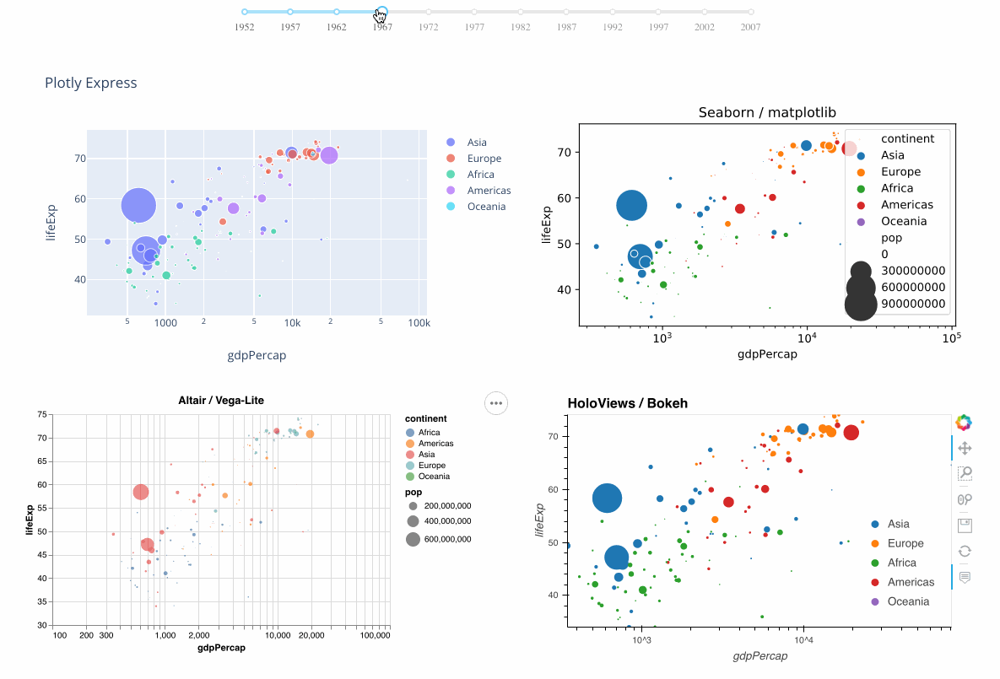

# dash-alternative-viz

In [Dash](https://dash.plot.ly/)'s built-in [`dash_core_components`](https://dash.plot.ly/dash-core-components) library, the `dcc.Graph` component uses standard [Plotly](https://plot.ly/python) figures.

Dash’s [component plugin system](https://dash.plot.ly/plugins) provides a
toolchain to create Dash components from any JavaScript-based library.
`dash-alternative-viz` is a proof-of-concept Dash component library that provides Dash
interfaces to Altair, matplotlib (or any compatible system like Seaborn, Pandas.plot, Plotnine and others!), and Bokeh (with or without HoloViews).

### [`usage.py`](https://github.com/plotly/dash-alternative-viz/blob/master/usage.py) demo

### Looking for something more generic?

The following components and component libraries are all **MIT-licensed and free for you to use**, just like Dash and Plotly:

- For general images (SVG, PNG, JPG, GIF), see the `html.Img` component.
- For XSS-safe Python interfaces for HTML, see [`dash_html_components`](https://dash.plot.ly/dash-html-components)
- For raw HTML or SVG strings, see [`dash_dangerously_set_inner_html`](https://github.com/plotly/dash-dangerously-set-inner-html)
- For interactive data tables, see [`dash_table`](https://dash.plot.ly/datatable)
- For interactive network graphs, see [`dash_cytoscape`](https://dash.plot.ly/cytoscape)
- For interactive controls & plotly graphs, see [`dash_core_components`](https://dash.plot.ly/dash-core-components)
- For bioinformatics components including circos, dendrograms, ideograms and more, see [`dash_bio`](https://dash.plot.ly/dash-bio)
- For interactive image editing and annotation, see [`dash_canvas`](https://dash.plot.ly/canvas)
- For technical components for data acq and engineering hardware, see [`dash_daq`](https://dash.plot.ly/dash-daq)

### Having trouble choosing which graphing library to use?

Of course we’re biased, but we think that the [Plotly](https://plot.ly/python) library has you covered
for almost any use-case. It’s in active development with dedicated full-time staff, and here are some new features ICYMI:
- Easy one-liner grammar-of-graphics-inspired dataframe plotting with [Plotly Express](https://medium.com/@plotlygraphs/introducing-plotly-express-808df010143d)
- Fast static image export with [`plotly.io`](https://medium.com/@plotlygraphs/plotly-py-end-of-summer-updates-5422c98b9058)
- Jupyter Widget support with [`FigureWidget`](https://medium.com/@plotlygraphs/introducing-plotly-py-3-0-0-7bb1333f69c6)
- A free [JupyterLab Chart Editor](https://github.com/plotly/jupyterlab-chart-editor)
- [JupyterLab support](https://github.com/plotly/jupyterlab-dash)
- [Datashader support](https://github.com/plotly/dash-datashader)
